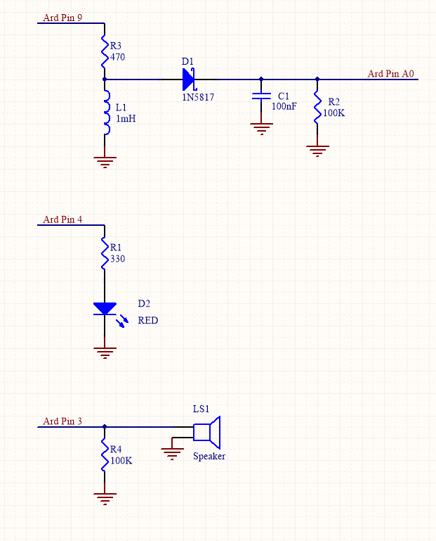
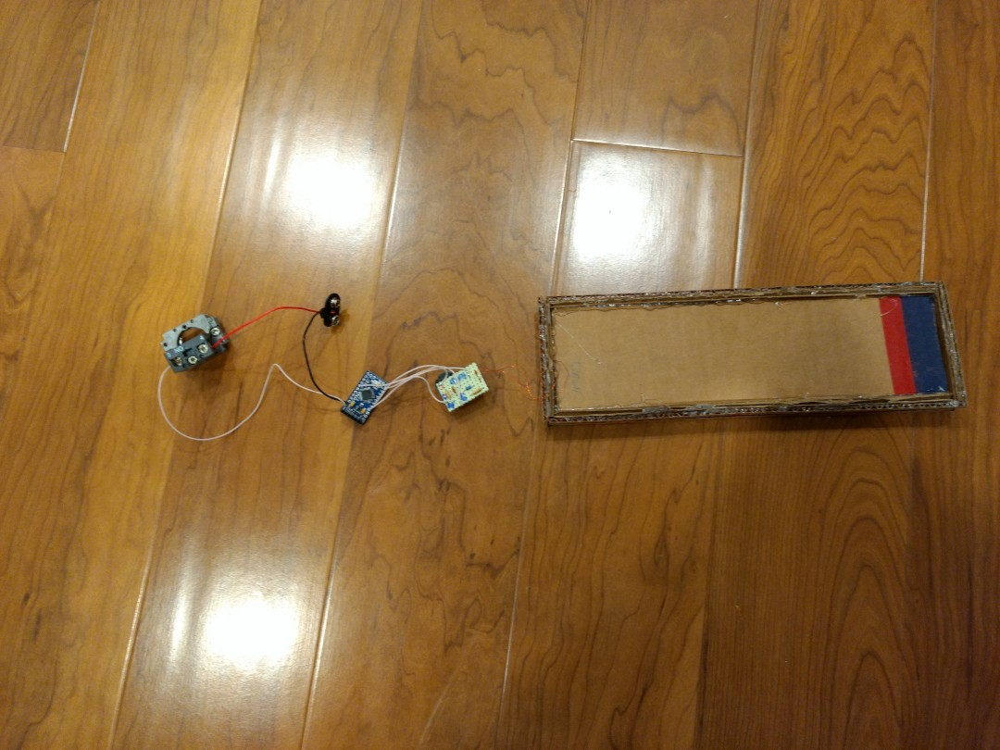
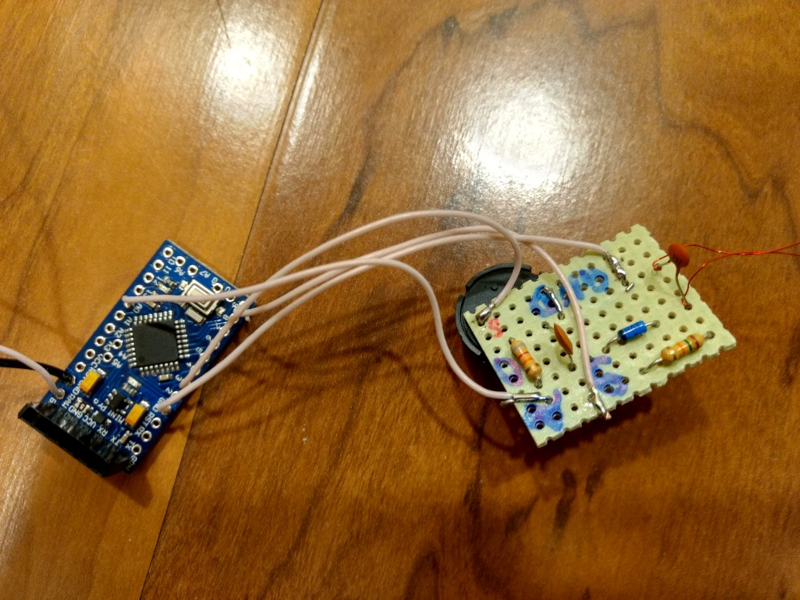

# MetalDetector
Simple Arduino-based metal detector.  
The antenna is 250mm x 70mm piece of cardboard with approximately 50 turns of 32AWG (0.2mm) wire. Measured antenna inductance is 1mH.
Pin 9 is configured to output 20KHz (50us period) square wave, this AC voltage is connected to the R3/L1 network. At 20KHz the reactance of the inductor is X = 2*pi*f*L1 = 125 Ohms. With R3 resistor, this reactance will form a voltage divider. By placing a piece of metal near the inductor L1, we'll change its inductance and reactance, and consequently the output voltage of the divider. 
To measure the output volatge of the R3/L1 network, we rectify it by the diode D1 and filter with C1 and R2. The resulting voltage is sampled by the Arduino ADC (Pin A0). This voltage is proportional to the inductance of the L1.
Arduino code is using TimerOne library, you can install it via Sketch/Include Libraries menu.  
  

Pictures of the actual device:
Coil, Main Board and Arduino Pro-Mini 

Arduino and Main Board 

Assembled device (cardboard, hot glue and fancy power switch)

