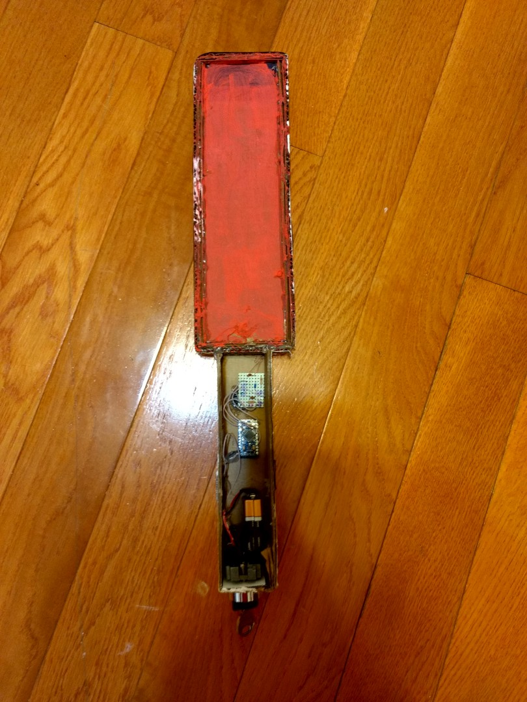

# MetalDetector
Simple Arduino-based metall detector.  
The antenna is 250mm x 70mm piece of cardboard with aproximately 50 turns of 32AWG (0.2mm) wire. Measured antenna inductance is 1.35mH (the value on the schematic is wrong).  
L1/C2 resonance frequency is ~230KHz. Pin 9 is configured to output 200KHz square wave, becasue this is the closes frequency I was able to generate using "TimerOne" library.  
Voltage from L1/C2 resonant circuit is getting rectified by the diode D2 and filtered with C3, R2. Resulting voltage is sampled by the Arduino ADC (Pin A0)  
  

Pictures of the actual device:
Coil, Main Board and Arduino Pro-Mini 

Arduino and Main Board 

Assembled device (cardboard, hot glue and fancy power switch)

